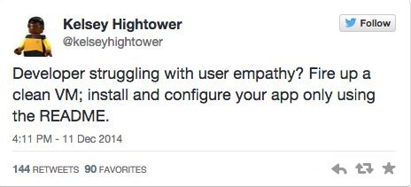

# README Refresh Day

## Orientation

These are the goals and agenda for Immersion 2015 README Refresh day.

This is a @3 hour session with all front- and back-end developers at the CFPB.

By the end, several of our READMEs will be improved, better positioning CFPB team members, and members of the public, 
to use and contribute to our software.

You'll apply the lessons learned and empathy gained during this session to your future work at the CFPB.

**Know this: we are taking advantage of this unique opportunity to have 10+ new sets of eyes on our projects!**

We will

1. Review what constitutes a good README
1. Review examples, good and bad
1. Break into groups
1. Get it done
1. Reconvene and go over the highlight reel
1. Be patient when things go off the rails
1. Be kind... assume the best. 
1. Be delighted by surprises

## Dependencies

1. 35 (?) devs
1. Laptops, github credentials
1. Coffee, tea, bagels, etc
1. Enough space for teams to work
1. Wifi
1. Screen and projector, Mac connector
1. 7 (?) READMEs for improvement, with 5 more as backups if needed. We'll want printouts with git URLs so people can take them. 
   Printouts should also have this README URL, so people can consult for instructions
1. Overall session scribe
1. Audio recording equipment

## Instructions

### Getting started (30-40 min)

1. Orientation (10 min)
1. What makes a good README? Look at [our template](https://github.com/cfpb/open-source-project-template); look at good/bad examples (15 min)
1. Introduce our volunteers (5 min)
1. Break into groups (5min). Each group must have
  2. at least one new fellow
  4. **NOTE**: we're optimizing for fresh eyes
  5. Go around the room by number

### Group work (2h)

Each group will then

1. Find a space, either in the conference room or in 10th floor project rooms / open space
1. Designate a primary author for the changes. This person will coordinate everyone's input and submit the pull request with all suggestions
1. Everyone in the group will fork the repo and clone it onto their mac
1. Group members will then work through the README, trying to get the software running on their Mac, either in a VM or locally
1. Group members will note missing or inaccurate info, improvements, etc. 
1. Group members will use this process to
  1. improve the README 
  1. potentially change the software itself, including adding automation scripts, etc
  1. potentially file enhancement requests in the repo's issue tracker
1. The primary author must push the changes to their own fork (for demo purposes)
1. If you're ready, submit a pull request
1. If you have no suggestions and the README is perfect, submit an issue to that repo indicating you reviewed it and it gets a thumbs up. 
Extra points for selfies.

**NOTE**: don't submit pull requests to public repos that contain internal URLs

**If you finish early**

You have options

1. Get another README from the organizers and repeat above; or
2. As a group, write about this process, what you learned or how you improved the README/software, 
which will serve as starter material for the article we publish on http://cfpb.github.io

### Highlight reel (45 min)

Each group gets 5 or so minutes to talk about

1. their favorite changes
1. delights / surprises

## Post-session expectations

1. For each project, the group submits a Pull Request
1. Any other improvements to the software can also be submitted
1. Any suggested improvements, not completed during the session, should be added as issues to the repo's issue tracker
1. Working with the session scribe, I'd like to turn this process, and what we learn during it, into an article for http://cfpb.github.io

## Session scribe responsibilities

The overall session scribe actively listens and documents during the everyone-together portions of the session. 
Capturing the discussion is critical for a proper post-session write-up on cfpb.github.io
 
## Lessons learned

1. Allot at least three hours of dedicated time for your README Refresh Day. 
   We felt rushed and could’ve used another 30-60 minutes
1. Have enough READMEs preselected that teams can move on to another if they finish the first.
1. Teams should pick another README if they start to work on a README and realize they are unable to continue. 
   For example, a team might realize that the README they selected requires some specific knowledge that they don’t possess.
   In these cases, it’s better to switch to a README they can quickly improve in the time allotted, 
   rather than spend a lot of time trying to learn the prerequisite knowledge.
1. When teams broke into small groups and went to separate rooms, we used a dedicated chat room to ask and answer questions, paste links, etc.
